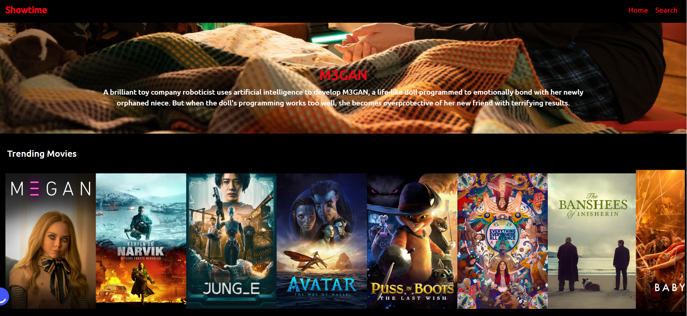

# Showtime🎬🎞️🎦🎥

This project was generated with [Angular CLI](https://github.com/angular/angular-cli) version 15.1.1.

## Screenshot

## Development server

Run `ng serve` for a dev server. Navigate to `http://localhost:4200/`. The application will automatically reload if you change any of the source files.

## Build

Run `ng build` to build the project. The build artifacts will be stored in the `dist/` directory.

## Further help

To get more help on the Angular CLI use `ng help` or go check out the [Angular CLI Overview and Command Reference](https://angular.io/cli) page.
